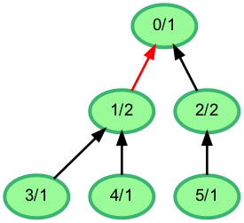
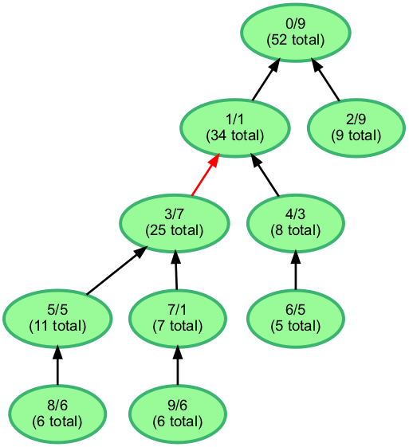

# Somebody's question about a sewer as a tree

*This was sent to me as a [screen cap](images/source_question.png)*

## Original question as asked

A sewer drainage system is structured as a tree. Water enters the system at n nodes numbered from _0_ to _n-1_ and flows through the tree to the root, which has the number _0_. The tree structure is defined by an array _parent_, where _parent[i] = j_ means that water flows from node _i_ to its direct parent node _j_. Water exits the system after it flows through the root, so the root has no parent, represented as _parent[0] = -1_. The value in _input[i]_ denotes the amount of water that enters the serwer system at node _i_. This excludes water that flows into _i_ from its children. The total flow through a node is thus the flow that enters at that node, plus the sum of the total flows of all of its children.

Your task is to divide the system into two smaller pieces by cutting one branch so that the total flows of the resulting subtrees are as close as possible.

**Example**

_parent = [-1, 0, 0, 1, 1, 2]_

_input = [1, 2, 2, 1, 1, 1]_

The structure of the system is shown in the diagram below. The nodes labeled as _\<node number\>/\<input flow\>_.



Cut the branch between nodes 1 and 0.

The partition {0, 2, 5} has the flow _input[0] + input[2] + input[5] = 1 + 2+ 1 = 4_.

## Solution

The `parents` format is sufficient, but inconvenient. The first thing we can do is to convert it into a map of source to children. From there, it is easy to define a recursive function to fill in all of the totals -- the total of the current node is its input plus the input from each of its children. To prevent recalculating, we can memoize the totals for each input. In this implementation, the calculation is performed by the `getTotalInflow` method, which uses `subInflows` to store the memoized values. The children mapping and memoizing is calculated in `getSubInflows`, which returns the memoized totals. 

We know that `subInflows[0]` represents the total at the root, which is the total of the whole system. So the cut line should be above the node that is closest to half that number. We can just walk through the nodes, looking for the node with the total closest to that half. 

### Extras

The [output](output.go) from the code in this repo is a [DOT file](https://graphviz.org/doc/info/lang.html) that looks a lot like the original screenshot, but I am highlighting the edge to cut in red and include the total in each node.

To show that the algorithm actually works, there is a [generator](generator.go) that produces `parents` and `inputs` records randomly. The sample below shows how that looks. 

## Sample

```text
parents = [-1, 0, 0, 1, 1, 3, 4, 3, 5, 7]
inputs = [9, 1, 9, 7, 3, 5, 5, 1, 6, 6]
```



Most of the time, one of the inputs to the root node is where the cut lies, but not always. In this case, cutting the red edge would result in one subgraph of 25 and the other of 27 (52 - 25).
